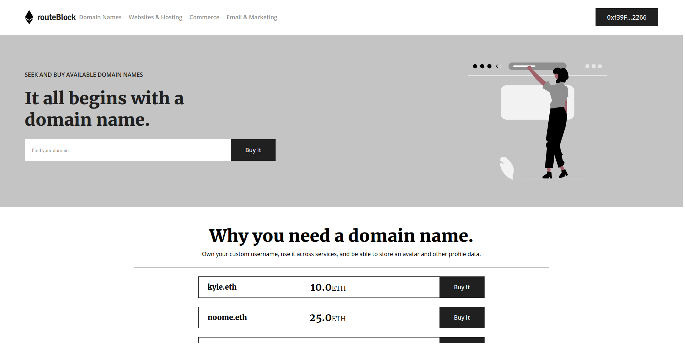

<p align="center">
	 </img>
	<h1 align="center">routeBlock</h3>
	<p> Please note that this is a test project and not intended to be deployed to production. It serves as a demonstration of the potential benefits of using Solidity smart contracts to sell web3 URLs with easy-to-remember names. </p>
</p>


<h4 align="center"> Introducing a revolutionary way to access web3 URLs with ease and simplicity! With our web3 website powered by Solidity smart contracts, you can now purchase web3 URLs with memorable and easy-to-remember names like "kyle.eth" instead of complicated and forgettable tags like "0x70997970C51812dc3A010C7d01b50e0d17dc79C8".
    <br>
</h4>

<h4 align="center"> Our solution offers a user-friendly way to access web3 content without the hassle of remembering and typing out long, complex tags. Say goodbye to frustration and confusion and hello to a streamlined and effortless experience with our web3 website. Try it out today and experience the convenience for yourself!
    <br>
</h4>

---

<p align="center">
 <a href="#about">About</a> •
 <a href="#started">Getting started</a> •
 <a href="#built_using">Technologies</a> •
 <a href="#authors">Authors</a> •
 <a href="#acknowledgement">Acknowledgements</a>
</p>

---

## 🧐 About <a name="about"><a/>

### 🧠 Problem Statement <a name = "problem_statement"></a>

    1.Complex and difficult-to-remember web3 URLs.
    2.Unauthorized or fraudulent transfer of web3 URL ownership.
    3.Limited adoption and accessibility of web3 technology.
	
### 💡 Idea / Solution <a name = "idea"></a>

This solution addresses the problem of user-unfriendly web3 URLs, which can be long and complex to remember and type correctly. By using Solidity smart contracts to sell web3 URLs with easy-to-remember names, users can easily access web3 content without the need to remember long, complex tags. This can improve the user experience and make it easier for people to engage with web3 content, potentially leading to wider adoption of web3 technology. Additionally, the use of Solidity smart contracts can provide a secure and transparent way to sell and transfer web3 URLs, which can help to prevent fraudulent or unauthorized transfers of ownership.


## 🏁 Getting Started <a name = "started"></a>

### 🎐 Prerequisites

Prerequisites for this project are:

- Node.js version 12.22.0 or later

### ✨ Installing

A step-by-step to install and run the project locally.

1. Clone the project using the following command or install the zip:

```
git clone https://github.com/kylenoome/routeBlock.git
```

2. Install all the dependencies:

```
npm install
```

3. Run the project:

```
npx run start start
```

4. Open `http://localhost:3000` in the browser

## ⚙ Built with <a name = "built_using"></a>

### Technologies


# Hardhat

	
### Tools


## ✍️ Authors <a name = "authors"></a>

- [@kylenoome](https://github.com/kylenoome) - Creator of this project

## 🎉 Acknowledgements <a name = "acknowledgement"></a>

- [@Shields.io](https://github.com/badges) - For the awesome badges
- [@Simple Icons](https://github.com/simple-icons) - For the awesome icons
- [@Casper](https://github.com/vn7n24fzkq) - For the awesome summary cards
- [@ryo-ma](https://github.com/ryo-ma) - For the awesome github trophies
- [@Anurag Hazra](https://github.com/anuraghazra) - For the awesome github stat cards
- [@Jonah Lawrence](https://github.com/DenverCoder1) - For the awesome github streak cards and custom icon badges

## © License

- MIT License
